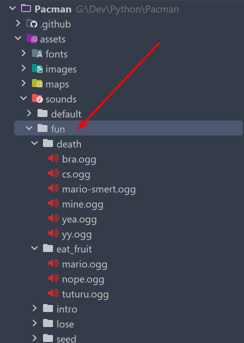

# Pacman

Pacman is a simple game written on Pygame. The game was created as a learning project to explore
the possibilities of Pygame and develop game applications.

## 📺 Preview
https://github.com/BaggerFast/Pacman/assets/54527361/415e3585-086f-4111-822f-5049471ccbd8

Watch  full video on [YouTube](https://youtu.be/2sRJK_TwXmk)

## 💻 Tech Stack
- [Python 3.10](https://www.python.org/)
- [Pygame](https://www.pygame.org/news)
- **Tools:**
  - [Black](https://github.com/psf/black)
  - [Isort](https://github.com/PyCQA/isort)
  - [PyLint](https://github.com/pylint-dev/pylint)
  - [CodeFactor](https://www.codefactor.io/)
    
## 👀 Look at this
- [Text](pacman/objects/text.py)
- [Button + controller](pacman/objects/buttons)
- [Sounds + controller](pacman/sound)
- [Scenes + SceneManager](pacman/scenes)
- [Animators + SpriteSheets](pacman/animator)
- [Saves - json serialize/deserialize](pacman/storage)

## 💾 Cheat codes
- In Game
  - **god** - victory scene
  - **kill** - lose scene
  - **aezakmi** - give 1 extra live
- In Menu
  - **pycman** - unlock all skins and levels

## 🎧 Set custom sounds in FUN MODE

## 🚑 Support 
Please click the `star` button, if this game was helpful to you.
