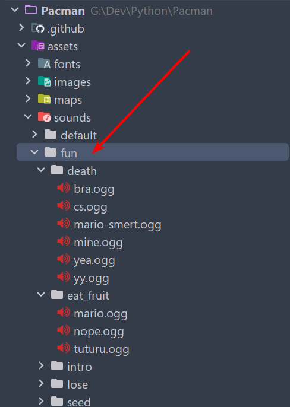

# Pacman
Pacman is a simple game written on Pygame. The game was created as a learning project to explore
the possibilities of Pygame and develop game applications.

## 📺 Preview
https://github.com/BaggerFast/Pacman/assets/54527361/415e3585-086f-4111-822f-5049471ccbd8

Watch  full video on [YouTube](https://www.youtube.com/watch?v=VpNoZ70wDEg)

## 💻 Tech Stack
- [python 3.13](https://www.python.org/)
- [pygame-ce](https://github.com/pygame-community/pygame-ce)
- **Tools:**
  - [uv](https://github.com/astral-sh/uv)
  - [ruff](https://github.com/astral-sh/ruff)
    
## 👀 Look at this
- [Text](pacman/objects/text.py)
- [Button + controller](pacman/objects/buttons)
- [Sounds + controller](pacman/sound)
- [Scenes + SceneManager](pacman/scenes)
- [Animators + SpriteSheets](pacman/animator)
- [Saves - json serialize/deserialize](pacman/storage)

## 💾 Cheat codes
- In Game
  - **god** - victory scene
  - **kill** - lose scene
  - **aezakmi** - give 1 extra live
- In Menu
  - **pycman** - unlock all skins and levels

## 🎧 Set custom sounds in FUN MODE

## 🚑 Support 
Please click the `star` button, if this game was helpful to you.
